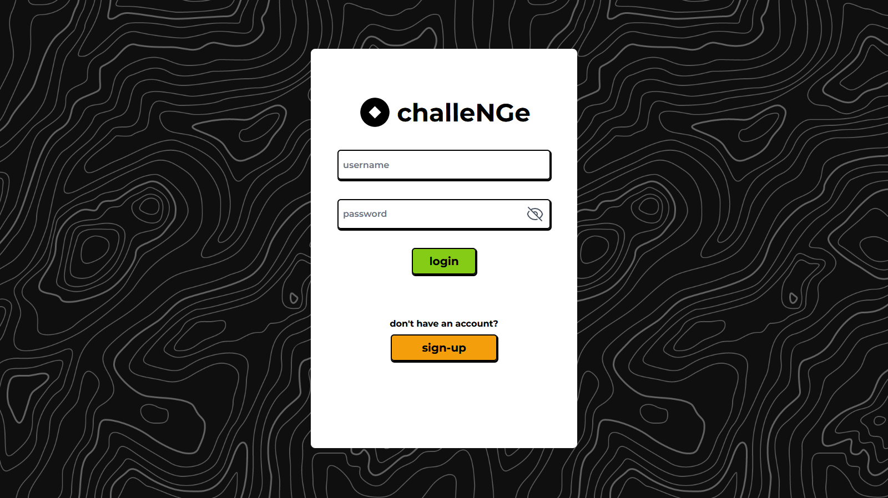
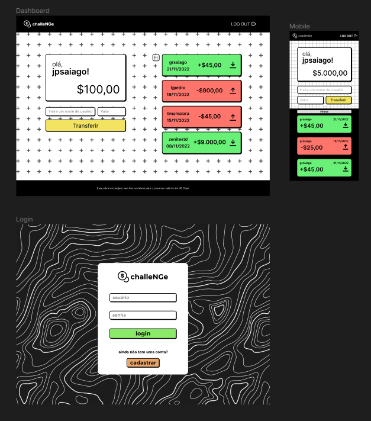

# challeNGe

<h3 align="center">💸 Transferências ágeis e seguras 💸</h3>


 
<div align="center">
   
    
</div>
<div align="center">
  
  
  
  
  
  
  
</div>
<div align="center">
  
  
  
  
</div>
<br/>

Esse projeto é uma plataforma fullstack para transferência de uma moeda digital sem valor real, que permite o cadastro usando usuário e senha,
transferências entre usuários e inspeção do seu histórico de transações.


## 📖 Índice

1. [Frontend](#-frontend)
   1. [Funcionalidades do frontend](#%EF%B8%8F-funcionalidades-do-frontend)
   2. [Escolhas no desenvolvimento](#-escolhas-no-desenvolvimento-do-frontend)
      1. [Vite](#vite)
      2. [Tanstack-Query vs. Redux](#tanstack-query-vs-redux)
      3. [Layout](#layout)
      4. [WindiCSS](#windicss)
      5. [Framer Motion](#framer-motion)
2. [Backend](#-backend)
   1. [Funcionalidades do backend](#%EF%B8%8F-funcionalidades-do-backend)
   2. [Escolhas no desenvolvimento](#-escolhas-no-desenvolvimento-do-frontend)
      1. [Prisma](#prisma)
      2. [Zod](#zod)
3. [Execução](#%EF%B8%8F-execu%C3%A7%C3%A3o)
4. [Instalação](#-instalação)
3. [Docker](#-docker)
6. [Testes](#-testes)
7. [Observações](#-observações)

## 💻 Frontend

### 🕹️ Funcionalidades do frontend

- 📱 Layout responsivo
- 🗝️ Sessões de usuário que ficam salvas por 24h
- 🔄 Sincronização periódica do histórico de transações
- 🎛️ Controle quais transações são exibidas e a sua ordem
- ⛔ Controle de erros e telas explicando o que pode ter ocorrido
- 🍂 Animações e transições agradáveis

### 🧠 Escolhas no desenvolvimento do Frontend

#### Vite

Dado que o objetivo do desafio era criar uma aplicação fullstack com um backend em `Node`, optei pelo `Vite` no frontend em vez de algo como `Next.js` ou `Remix`, já que esses frameworks rodam em um servidor que também funciona como um "backend".

#### Tanstack-Query vs Redux

Como a maior parte dos estados críticos da aplicação são assíncronos e dependentes do banco de dados, optei pelo `Tanstack-Query` (antes conhecido como `React-Query`),
um pacote já bem consolidado e conhecido responsável pelo gerenciamento assíncrono de estados, em vez de algo como `Redux` ou `Zustand/Jotai`.
O resto dos estados locais da aplicação foram gerenciados com o hook `useState` nativo.

#### Layout

O rascunho do layout da aplicação foi feito no `Figma`, com uma identidade colorida e inspirada no brutalismo na web.

<div align="center"></div>

#### WindiCss

O `WindiCSS` foi o método escolhido para estilização da aplicação. Se trata de um fork do `TailwindCSS` com algumas funções a mais, como agrupamento de estados e modificadores.
O próprio Tailwind, por sua vez, é uma biblioteca de estilização que aplica regras de css a partir de classes de utilidade, exigindo assim conhecimento prévio de css mas facilitando
a modificação e iteração dos estilos.

#### Framer Motion

Para animar as trocas de rota do `React Router`, utilizei a biblioteca `Framer Motion`, que foi usada também para coordenar animações de elementos dentro da UI.


## 📡 Backend

### 🕹️ Funcionalidades do backend

- 🔒 Autenticação de usuário com JWT
- 📋 Validação e sanitização de inputs
- 📨 Criação de contas e transações atômicas
- 📜 Logger personalizado que registra requisições e erros
- 📊 Prisma Studio configurado no ambiente Docker

### 🧠 Escolhas no desenvolvimento do Backend

#### Prisma

ORM moderna feita para o Typescript, com controle de migrações, transações atômicas nativas e o Prisma Studio que permite análise do banco de dados.

#### Zod

Biblioteca de validação nativa ao Typescript, extremamente útil para criar o middleware que valida o _input_ do usuário de acordo com o _schema_ esperado para cada rota.


## 📦 Instalação

Para clonar o projeto, execute o comando:

```bash
git clone https://github.com/jpsaiago/challenge-charlie.git
```

## ⚙️ Execução
As aplicações já estão configuradas, na maior parte, para serem executadas em um ambiente `Node` local. As exceções são:
- Instalar as dependências de cada parte, de preferência com o `pnpm` para usar o _lock-file_ já presente
- O backend precisa da url de conexão a uma instância do postgres, que pode ser adicionada ao arquivo `.env` da pasta Backend na seguinte forma:

- Depois de configurar essa conexão, execute o seguinte comando:
```bash
npx prisma migrate dev
```
O terminal vai pedir um nome para a migração e então irá criar as tabelas no banco e gerar o _client_ usado pela aplicação

## 🚢 Docker

Na raiz do repositório, temos um arquivo `docker-compose.yaml`

Não é necessário nenhum arquivo de configuração de ambiente para executar o projeto, visto que se trata de uma rede de containers conectada, a aplicação já está configurada para comunicação.

Dependendo da versão do `Docker/Docker Compose` que estiver presente na sua máquina, o comando que deve ser executado na raiz do repositório muda.

Na V2 do compose, execute:

```bash
docker compose up
```

Já na V1, execute:

```bash
docker-compose up
```

O Compose levantará 4 containers:

- Banco de dados na porta 5432
- Prisma Studio na porta 5555
- Backend na porta 8080
- Frontend na porta 8000

## 🧪 Testes
Existem alguns testes no backend que podem ser executados com:
```bash
npm test
```
desde que seu terminal esteja aberto na pasta que possui o `package.json` do backend.

## 🔭 Observações

- Dado o escopo da aplicação e para não prolongar demais o desenvolvimento do desafio, não escrevi testes para o Frontend, porém usaria o `Vitest`, suite de testes do `Vite` que usa uma `API` igual a do `Jest`.
- Também expandiria os testes já existentes no backend, usando o `Cypress` para os testes E-2-E e o `Jest` para os testes de integração.
- Também não configurei um ambiente de desenvolvimento com toda a aplicação rodando em conjunto, me utilizei do `Nodemon`, do modo de desenvolvimento do `Vite` e de um banco `Postgres` local.
- Uma das vantagens do Prisma é o conceito das migrações e de poder dar _roll-back_ nelas se algo acontecer de errado, porém para evitar a necessidade de executar comandos dentro do container apenas para criar o banco de dados, preparei um arquivo .sql que é usado na inicialização do banco de dados.
